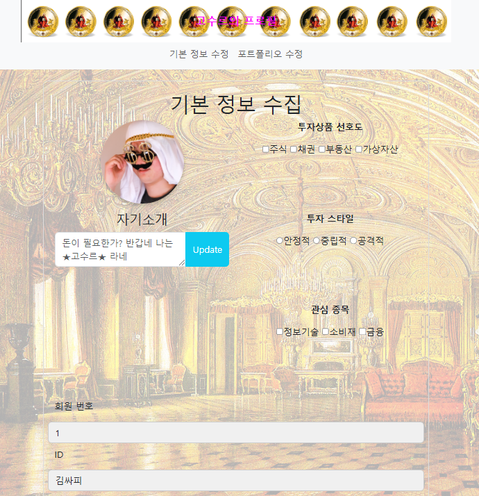

# 목차

```md
A. 기본 정보 수정 페이지 – 프로필 및 투자 성향
B. 기본 정보 수정 페이지 - 회원정보 입력
C. 네비게이션 바 구현
D. 포트폴리오 수정 페이지
E. 반응형 디자인 구현
```

# A. 기본 정보 수정 페이지 – 프로필 및 투자 성향
## A-1. 고민한 부분
- 프로필 사진과 투자 성향을 좌우로 배치하는 것을 div class card랑 div중 div card가 더 나을 것 같아 선택했으나 배치과정에서 글자가 자동 중앙 정렬되었음 <br>

- 우측의 투자상품 선호도, 투자스타일, 관심종목의 경우 여백이 pdf 요구사항과 다르게 조금 벌어져있는데, 이 부분은 해결하지 못하였다.

### A-2. 해결 과정
div calss card에서 div로 고쳐주니 글자가 좌측부터 잘 배치가 되었다

<br><br>

# B. 기본 정보 수정 페이지 - 회원정보 입력
## B-1. 고민한 부분
- 회원번호 아래 회색으로 된 border부분에 1이 적히게 하는 방법
- 맨 아래 `자산과 연봉`에서 달러표시와 맨끝에 update를 붙이는 것

### B-2. 해결 과정
- border 부분에 1이 적히게 하는 것은 input type를 작성하여 `읽기 전용`으로 고쳐 해결이 되었다
- `자산과 연봉`의 경우는 버튼을 앞뒤로 추가하여 해결해주었다.

<br><br>

# C. 네비게이션 바 구현
## C-1. 고민한 부분
- 최상단에 제목`프로필 페이지`와 바로 아래 기본 정보 수정, 포트폴리오 수정이 최대창, 최소창일때 겹치는 문제가 발생했었다. <br>

(추가)
- 네비게이션 바의 경우, 나는 배경화면을 색깔이 아닌 사진으로 추가하려했었는데, 이 과정에서 링크 버튼인 `기본 정보 수정, 포트폴리오 수정`을 가리는 사태다 발생했다.

### C-2. 해결 과정
- 문제는 기본 정보 수정, 포트폴리오 수정에 있는 mt-5 였으며 이를 제거해주니 정상적으로 최대창, 최소창일때 스크롤을 내려고 화면 최상단에 고정이 되었다. <br>
- 사진의 경우 background-image를 통해 잘 고정이 되었다.

<br><br>

# E. 반응형 디자인 구현
## E-1. 고민한 부분
- `화면 가로 사이즈가 768px 미만으로 내려가면 투자 성향 파트가 자기소개 밑으로 이동하도록 구성합니다.` <br>
해당 문제의 경우 어떻게 작성할지 몰라 구글과 chatgpt를 많이 활용하였다.


### E-2. 해결 과정
```css
/* ------------------- E ------------------------ */
        /* 반응형 디자인 구현 부분 */
        @media (max-width: 768px) {
                    /* 화면 가로 사이즈가 768px 미만으로 내려가면, '투자 성향' 파트가 '자기소개' 아래로 이동 */
                    .row .col-md-6 {
                        margin-bottom: 15px;
                    }

                    .investment-style {
                        order: 2;
                        /* 투자 성향을 두 번째로 배치 */
                        margin-top: 20px;
                    }

                    .profile-img {
                        width: 120px;
                        height: 120px;
                    }

                    .h1 {
                        font-size: 1.5rem;
                    }

                    /* 반응형에 맞춰 모든 글씨 크기 조정 */
                    .p, .p1, .p2, .p3 {
                        font-size: 14px;
                    }
                }
```

<br><br>


# ★추가 구현
## 고민한 부분
- 스크롤을 내려도 배경사진이 계속 유지되게 하고 싶었으나 배경사진이 끊기는 문제를 해결하지 못함.

### 해결 과정
-

<br><br>

# 최종 결과는 다음과 같습니다.

